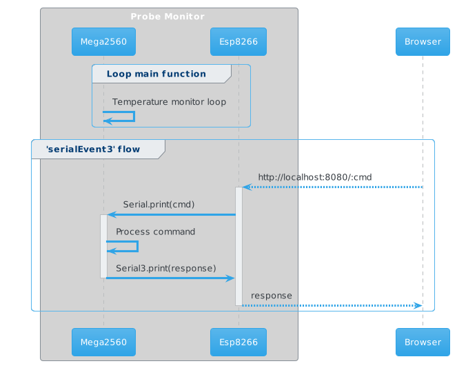

# Probe Monitor

WiFi temperature monitor based on Arduino and DS18B20 sensors.
The temperature sensors are driven by external sources. This is the main feature of the device: according to my needs, the sensors should only activate when some solenoid valves open.

The solenoid valves are powered by 230V, then power drivers are used to reduce the sensors to working 5V.

## Prerequisites
### Hardware
* Arduino MEGA 2560 With WiFi Built-in ESP8266
* Micro SD card adatper
* DS1302 RealTime clock
* DS18B20 temperature sensors
* HD44780 16x02 Blaues Display Datenblatt

[Here](docs/hardware.md) are listed some technical notes about hardware properties and configurations.

### Libraries
* [RTC](https://www.arduino.cc/reference/en/libraries/rtc-by-makuna/) by Makuna
* [Dallas Temperature](https://www.arduino.cc/reference/en/libraries/dallastemperature/) by Miles Burton 

## Mega2560 to ESP8266 communication flows
### Circuit setup

### Setup phase

### Loop phase

## Roadmap
- [ ] Improve serial communication between Mega&Esp to make server fully working, in particular for log file download
- [ ] Improve serve endpoint for probes customization
- [ ] Add monitor to show device IP and current date-time
- [ ] Add button to:
  - [ ] enable monitor
  - [ ] set date and time
  - [ ] change reading interval
